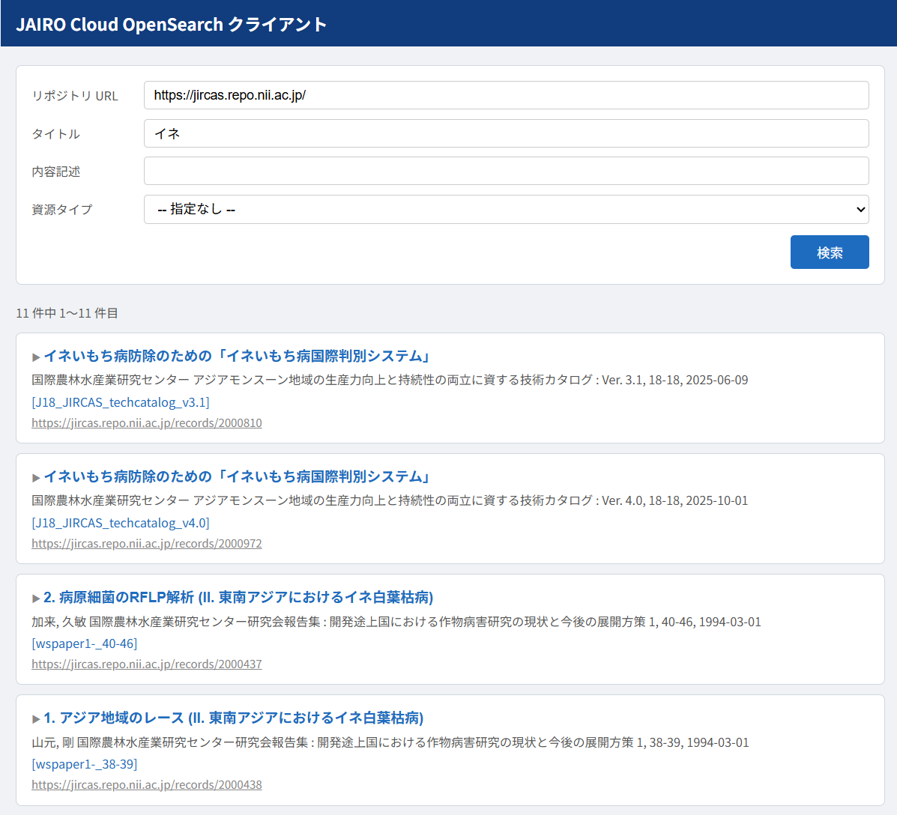

# JAIRO Cloud OpenSearch クライアント

JAIRO Cloud で構築された機関リポジトリに対して OpenSearch 検索を実行し、結果を一覧表示するブラウザ用クライアントです。

## 画面例



## 特徴

- 単一の HTML ファイルで完結しています。
- タイトル・内容記述・資源タイプによるキーワード検索を行います。
- 検索結果を JPCOAR スキーマ XML から取得し、書誌情報を一覧表示します。
- タイトルクリックで全 JPCOAR フィールドを展開して表示します。
- ページング対応（20件/ページ）
- Cloudflare Workers によるプロキシ経由でJAIRO Cloudにアクセスします。これにより CORS 問題を回避しています。

## 使い方

### GitHub Pages で使う（推奨）

[https://tzhaya.github.io/jc-opensearch-client/](https://tzhaya.github.io/jc-opensearch-client/) をブラウザで開く。

### ローカルで使う

1. `jc-opensearch.html` をブラウザで開く
2. 検索対象の機関リポジトリ URL を入力（例: `https://jircas.repo.nii.ac.jp/`）
3. キーワードを入力して検索
   - ローカルで使用する場合は CORS の制限があります。ブラウザ拡張機能等で CORS を解除してください

## ファイル構成

| ファイル | 説明 |
|---|---|
| `jc-opensearch.html` | メインの HTML テンプレート（CONFIG は空白） |
| `.github/workflows/deploy.yml` | GitHub Actions デプロイワークフロー |
| `docs/requirements.md` | 要件定義 |
| `docs/implementation.md` | 実装計画 |
| `docs/worklog.md` | 作業ログ |
| `docs/resource_type_vocabulary.md` | 資源タイプ語彙一覧 |

## 設定

`jc-opensearch.html` の先頭付近にある CONFIG セクションを編集します。

```javascript
// ===== CONFIG =====
const CONFIG = {
  repositoryUrl: '',  // 検索対象リポジトリの初期値（任意）例: 'https://jircas.repo.nii.ac.jp/'
  proxyUrl: ''        // Cloudflare Workers プロキシ URL（公開運用時に設定）
};
// ==================
```

### repositoryUrl

検索フォームの「リポジトリ URL」欄に表示される初期値です。

- 空のままにしておくと、ユーザが画面上で URL を入力する必要があります
- 特定のリポジトリ専用として配布する場合は、URL を設定しておくと便利です
- 画面上で入力した URL は CONFIG の値より優先されます

### proxyUrl

JAIRO Cloud API への CORS 問題を回避するための Cloudflare Workers プロキシ URL です。

- ローカルで使用する場合は空のままでも、ブラウザ拡張機能等で CORS を解除すれば動作します
- Web サーバーで公開する場合は Cloudflare Workers を設定し、URL を記入してください
- `proxyUrl` が設定されている場合、すべての API リクエストはプロキシ経由になります

### GitHub Pages のセットアップ

1. GitHub リポジトリの **Settings → Secrets and variables → Actions** に `PROXY_URL` シークレットを追加（Cloudflare Worker の URL を設定）
2. **Settings → Pages** の Source を **「GitHub Actions」** に変更
3. `master` ブランチへ push すると自動的にデプロイされます

デプロイ時、GitHub Actions が `jc-opensearch.html` の `proxyUrl: ''` をシークレット値で置換した `index.html` を生成します。`index.html` はリポジトリには含まれません。

### Cloudflare Workers のセットアップ

Cloudflare Workers を使用してプロキシを立てる手順は以下の通りです。

1. [Cloudflare](https://dash.cloudflare.com/) にサインアップ（GitHub 連携可）
2. **Workers & Pages** → **Create** → **Hello World** テンプレートを選択
3. Worker 名を入力して Deploy
4. Edit code から以下のコードに置き換えて再 Deploy

```javascript
// SSRF 対策: JAIRO Cloud 利用機関リストに基づくホスト制限
// 出典: https://docs.google.com/spreadsheets/d/1oNjykAjC2uvTV0KdUHflOwOq0Y7tMSqc10GivORNFMc/
// *.repo.nii.ac.jp は正規表現で一括許可、それ以外の機関は個別に列挙
const ALLOWED_HOST_PATTERN = /\.repo\.nii\.ac\.jp$/i;
const ALLOWED_HOSTS_EXTRA = new Set([
  'repository.nii.ac.jp',
  'd-repo.ier.hit-u.ac.jp',
  'repository.lib.tottori-u.ac.jp',
  'ismrepo.ism.ac.jp',
  'repository.ninjal.ac.jp',
  'ir.soken.ac.jp',
  'repository.dl.itc.u-tokyo.ac.jp',
  'teapot.lib.ocha.ac.jp',
  'kutarr.kochi-tech.ac.jp',
  'ir.jikei.ac.jp',
  'ir.kagoshima-u.ac.jp',
  'amcor.asahikawa-med.ac.jp',
  'repository.ffpri.go.jp',
  'repository.jircas.go.jp',
  'repository.naro.go.jp',
  'ir.ide.go.jp',
  'repo.qst.go.jp',
  'repo-tkfd.jp',
]);

// CORS 対策: このプロキシを使用するページのオリジンを設定してください
// 例: GitHub Pages の場合は 'https://<username>.github.io'
//     独自ドメインの場合は 'https://example.com'
// ※ パス（/jc-opensearch-client/ など）は含めません
// ※ CORS はブラウザ向けの制約であり、curl 等のサーバー間通信は防止できません。
//   不正利用が懸念される場合は Cloudflare Access や Rate Limiting の利用を検討してください。
const ALLOWED_ORIGIN = 'https://<username>.github.io';

export default {
  async fetch(request) {
    const origin = request.headers.get('Origin');
    const corsOrigin = origin === ALLOWED_ORIGIN ? ALLOWED_ORIGIN : null;

    if (request.method === 'OPTIONS') {
      const headers = { 'Vary': 'Origin' };
      if (corsOrigin) {
        headers['Access-Control-Allow-Origin'] = corsOrigin;
        headers['Access-Control-Allow-Methods'] = 'GET';
      }
      return new Response(null, { headers });
    }

    const url = new URL(request.url);
    const repo = url.searchParams.get('repo');
    if (!repo) return new Response('Missing repo parameter', { status: 400 });

    // SSRF 対策: https のみ許可・非標準ポート拒否・許可ホストのみ転送
    let repoUrl;
    try {
      repoUrl = new URL(repo);
    } catch {
      return new Response('Invalid repo URL', { status: 400 });
    }
    if (repoUrl.protocol !== 'https:' || repoUrl.port !== '') {
      return new Response('Forbidden', { status: 403 });
    }
    const repoHost = repoUrl.hostname.toLowerCase();
    if (!ALLOWED_HOST_PATTERN.test(repoHost) && !ALLOWED_HOSTS_EXTRA.has(repoHost)) {
      return new Response('Forbidden', { status: 403 });
    }

    url.searchParams.delete('repo');
    const targetUrl = `${repoUrl.origin}/api/opensearch/search?${url.searchParams.toString()}`;

    let response;
    try {
      response = await fetch(targetUrl, {
        redirect: 'manual',
        signal: AbortSignal.timeout(10000),
      });
    } catch {
      return new Response('Upstream request failed', { status: 502 });
    }

    // リダイレクト応答はそのまま通さない（SSRF 回避）
    if (response.status >= 300 && response.status < 400) {
      return new Response('Redirect not allowed', { status: 502 });
    }

    const newResponse = new Response(response.body, response);
    if (corsOrigin) {
      newResponse.headers.set('Access-Control-Allow-Origin', corsOrigin);
    } else {
      newResponse.headers.delete('Access-Control-Allow-Origin');
    }
    newResponse.headers.set('Vary', 'Origin');
    return newResponse;
  }
};
```

5. 払い出された Worker URL（例: `https://your-worker.your-subdomain.workers.dev`）を CONFIG の `proxyUrl` に設定

## 参照仕様

- [WEKO3 OpenSearch API](https://github.com/RCOSDP/weko-document/blob/main/docs/spec/base/api/API_03_OpenSearch.md)
- [JPCOAR スキーマ](https://github.com/JPCOAR/schema/blob/master/1.0/jpcoar_scm.xsd)

## 変更履歴

| 日付 | 内容 |
|---|---|
| 2026-02-23 | Worker セキュリティ強化: リダイレクト追従禁止・https/ポート制限・タイムアウト追加・不許可 Origin 時の CORS ヘッダー省略 |
| 2026-02-23 | Worker の CORS を GitHub Pages オリジンのみに制限（`Access-Control-Allow-Origin: *` を廃止） |
| 2026-02-23 | GitHub Actions による GitHub Pages デプロイを追加（proxyUrl をシークレット管理） |
| 2026-02-23 | ALLOWED_HOST を JAIRO Cloud 利用機関リスト（スプレッドシート）に基づいて更新 |
| 2026-02-23 | Cloudflare Workers プロキシ対応 |
| 2026-02-22 | 初版リリース |

## Author

Takanori Hayashi

## License

[CC0 1.0 Universal](LICENSE)
