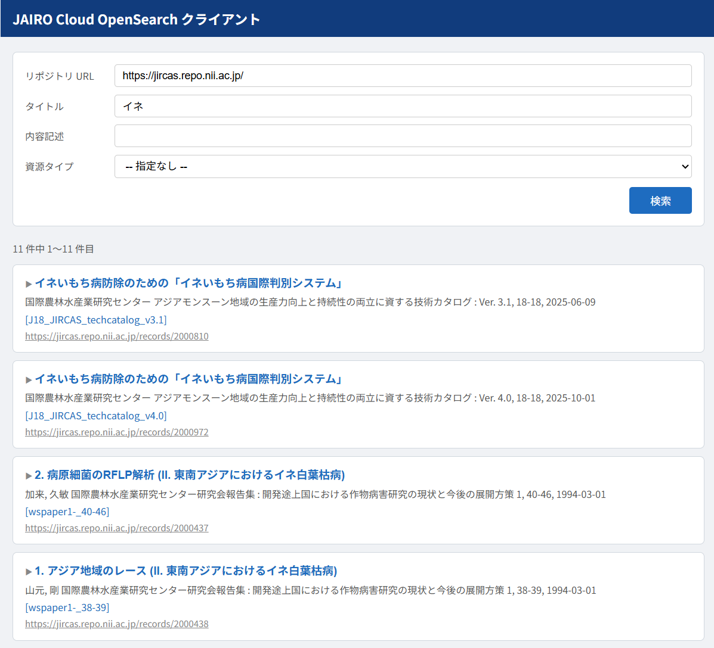

# JAIRO Cloud OpenSearch クライアント

JAIRO Cloud で構築された機関リポジトリに対して OpenSearch 検索を実行し、結果を一覧表示するクライアントです。

3つの利用形態があります。

| 形態 | CORS 対策 | 特徴 |
|---|---|---|
| **Web ブラウザ版** | Cloudflare Workers プロキシ経由 | GitHub Pages 等で公開。セットアップに Workers の設定が必要 |
| **Chrome 拡張版** | バックグラウンドワーカーで直接通信 | サイドパネルで動作。プロキシ不要 |
| **Electron デスクトップアプリ版** | メインプロセスで直接通信 | 単体アプリとして動作。プロキシ不要 |

## 画面例



## 特徴

- タイトル・内容記述・資源タイプによるキーワード検索を行います
- 検索結果を JPCOAR スキーマ XML から取得し、書誌情報を一覧表示します
- タイトルクリックで全 JPCOAR フィールドを展開して表示します
- ページング対応（20件/ページ）

## 使い方

### Web ブラウザ版

#### Web サーバに設置する

- 例: GitHub Pages に設置する
  - [https://tzhaya.github.io/jc-opensearch-client/](https://tzhaya.github.io/jc-opensearch-client/) をブラウザで開く

#### ローカルで使う

1. `jc-opensearch.html` をブラウザで開く
2. 検索対象の機関リポジトリ URL を入力（例: `https://jircas.repo.nii.ac.jp/`）
3. キーワードを入力して検索
   - ローカルで使用する場合は CORS の制限があります。ブラウザ拡張機能等で CORS を解除してください

### Chrome 拡張版（サイドパネル）

Chrome のサイドパネルで検索クライアントを使用できます。プロキシサーバーは不要です。

#### インストール手順

1. このリポジトリの `chrome-extension` フォルダをローカルにダウンロードする
   - リポジトリ全体を ZIP でダウンロード: **Code** → **Download ZIP** → 展開後 `chrome-extension` フォルダを使用
   - または `git clone` でリポジトリをクローンする
2. Chrome で `chrome://extensions` を開く
3. 右上の **「デベロッパー モード」** をオンにする
4. **「パッケージ化されていない拡張機能を読み込む」** をクリック
5. ダウンロードした `chrome-extension` フォルダを選択
6. 拡張機能一覧に「JAIRO Cloud OpenSearch クライアント」が追加される

#### 使い方

1. Chrome ツールバーの拡張機能アイコンをクリック → サイドパネルが開く
2. リポジトリ URL を入力（例: `https://jircas.repo.nii.ac.jp/`）
3. キーワードを入力して検索

#### 注意事項

- Chrome 114 以降が必要です（サイドパネル API）
- 拡張機能のバックグラウンドワーカーが API リクエストを中継するため、CORS の制約を受けません
- アクセス可能なホストは JAIRO Cloud 利用機関に限定されています（`manifest.json` の `host_permissions`）

### Electron デスクトップアプリ版

単体のデスクトップアプリケーションとして動作します。プロキシサーバーは不要です。

#### 必要なもの

- [Node.js](https://nodejs.org/) 20 以降
- [Git](https://git-scm.com/)（リポジトリのクローンに使用）

#### セットアップと起動

```bash
# リポジトリをクローン
git clone https://github.com/tzhaya/jc-opensearch-client.git
cd jc-opensearch-client

# 依存パッケージのインストール（初回のみ）
npm install

# アプリを起動
npm start
```

#### 使い方

1. `npm start` を実行するとアプリウィンドウが開きます
2. **リポジトリ URL** 欄に検索対象の機関リポジトリ URL を入力（例: `https://jircas.repo.nii.ac.jp/`）
3. **キーワード** を入力して「検索」ボタンをクリック
4. 検索結果のタイトルをクリックすると詳細情報が展開されます
5. タイトルのリンクをクリックすると、既定のブラウザで該当ページが開きます

#### 注意事項

- 現在 Windows のみ対応です
- メインプロセスが API リクエストを実行するため、CORS の制約を受けません
- HTTPS 通信のみ許可、リクエストタイムアウトは 15 秒です

## ファイル構成

| ファイル / フォルダ | 説明 |
|---|---|
| `jc-opensearch.html` | Web ブラウザ版 HTML テンプレート（CONFIG は空白） |
| `chrome-extension/` | Chrome 拡張版（サイドパネル方式） |
| `chrome-extension/manifest.json` | 拡張機能マニフェスト（Manifest V3） |
| `chrome-extension/background.js` | バックグラウンドワーカー（fetch プロキシ） |
| `chrome-extension/sidepanel.html` | サイドパネル UI |
| `chrome-extension/sidepanel.js` | サイドパネル ロジック |
| `src/main.js` | Electron メインプロセス |
| `src/preload.js` | Electron プリロードスクリプト（IPC ブリッジ） |
| `src/renderer/index.html` | Electron レンダラー UI |
| `package.json` | Electron 依存関係 |
| `.github/workflows/deploy.yml` | GitHub Pages デプロイワークフロー |
| `docs/requirements.md` | 要件定義 |
| `docs/implementation.md` | 実装計画 |
| `docs/electron-migration-plan.md` | Electron 移行計画 |
| `docs/worklog.md` | 作業ログ |
| `docs/resource_type_vocabulary.md` | 資源タイプ語彙一覧 |

## 設定

`jc-opensearch.html` の先頭付近にある CONFIG セクションを編集します。

```javascript
// ===== CONFIG =====
const CONFIG = {
  repositoryUrl: '',  // 検索対象リポジトリの初期値（任意）例: 'https://jircas.repo.nii.ac.jp/'
  proxyUrl: ''        // Cloudflare Workers プロキシ URL（公開運用時に設定）
};
// ==================
```

### repositoryUrl

検索フォームの「リポジトリ URL」欄に表示される初期値です。

- 空のままにしておくと、ユーザが画面上で URL を入力する必要があります
- 特定のリポジトリ専用として配布する場合は、URL を設定しておくと便利です
- 画面上で入力した URL は CONFIG の値より優先されます

### proxyUrl

JAIRO Cloud API への CORS 問題を回避するための Cloudflare Workers プロキシ URL です。

- ローカルで使用する場合は空のままでも、ブラウザ拡張機能等で CORS を解除すれば動作します
- Web サーバーで公開する場合は Cloudflare Workers を設定し、URL を記入してください
- `proxyUrl` が設定されている場合、すべての API リクエストはプロキシ経由になります

### GitHub Pages のセットアップ

1. GitHub リポジトリの **Settings → Secrets and variables → Actions** に `PROXY_URL` シークレットを追加（Cloudflare Worker の URL を設定）
2. **Settings → Pages** の Source を **「GitHub Actions」** に変更
3. `master` ブランチへ push すると自動的にデプロイされます

デプロイ時、GitHub Actions が `jc-opensearch.html` の `proxyUrl: ''` をシークレット値で置換した `index.html` を生成します。`index.html` はリポジトリには含まれません。

### Cloudflare Workers のセットアップ

Cloudflare Workers を使用してプロキシを立てる手順は以下の通りです。

1. [Cloudflare](https://dash.cloudflare.com/) にサインアップ（GitHub 連携可）
2. **Workers & Pages** → **Create** → **Hello World** テンプレートを選択
3. Worker 名を入力して Deploy
4. Edit code から以下のコードに置き換えて再 Deploy

```javascript
// SSRF 対策: JAIRO Cloud 利用機関リストに基づくホスト制限
// 出典: https://docs.google.com/spreadsheets/d/1oNjykAjC2uvTV0KdUHflOwOq0Y7tMSqc10GivORNFMc/
// *.repo.nii.ac.jp は正規表現で一括許可、それ以外の機関は個別に列挙
const ALLOWED_HOST_PATTERN = /\.repo\.nii\.ac\.jp$/i;
const ALLOWED_HOSTS_EXTRA = new Set([
  'repository.nii.ac.jp',
  'd-repo.ier.hit-u.ac.jp',
  'repository.lib.tottori-u.ac.jp',
  'ismrepo.ism.ac.jp',
  'repository.ninjal.ac.jp',
  'ir.soken.ac.jp',
  'repository.dl.itc.u-tokyo.ac.jp',
  'teapot.lib.ocha.ac.jp',
  'kutarr.kochi-tech.ac.jp',
  'ir.jikei.ac.jp',
  'ir.kagoshima-u.ac.jp',
  'amcor.asahikawa-med.ac.jp',
  'repository.ffpri.go.jp',
  'repository.jircas.go.jp',
  'repository.naro.go.jp',
  'ir.ide.go.jp',
  'repo.qst.go.jp',
  'repo-tkfd.jp',
]);

// CORS 対策: このプロキシを使用するページのオリジンを設定してください
// 例: GitHub Pages の場合は 'https://<username>.github.io'
//     独自ドメインの場合は 'https://example.com'
// ※ パス（/jc-opensearch-client/ など）は含めません
// ※ CORS はブラウザ向けの制約であり、curl 等のサーバー間通信は防止できません。
//   不正利用が懸念される場合は Cloudflare Access や Rate Limiting の利用を検討してください。
const ALLOWED_ORIGIN = 'https://<username>.github.io';

export default {
  async fetch(request) {
    const origin = request.headers.get('Origin');
    const corsOrigin = origin === ALLOWED_ORIGIN ? ALLOWED_ORIGIN : null;

    if (request.method === 'OPTIONS') {
      const headers = { 'Vary': 'Origin' };
      if (corsOrigin) {
        headers['Access-Control-Allow-Origin'] = corsOrigin;
        headers['Access-Control-Allow-Methods'] = 'GET';
      }
      return new Response(null, { headers });
    }

    const url = new URL(request.url);
    const repo = url.searchParams.get('repo');
    if (!repo) return new Response('Missing repo parameter', { status: 400 });

    // SSRF 対策: https のみ許可・非標準ポート拒否・許可ホストのみ転送
    let repoUrl;
    try {
      repoUrl = new URL(repo);
    } catch {
      return new Response('Invalid repo URL', { status: 400 });
    }
    if (repoUrl.protocol !== 'https:' || repoUrl.port !== '') {
      return new Response('Forbidden', { status: 403 });
    }
    const repoHost = repoUrl.hostname.toLowerCase();
    if (!ALLOWED_HOST_PATTERN.test(repoHost) && !ALLOWED_HOSTS_EXTRA.has(repoHost)) {
      return new Response('Forbidden', { status: 403 });
    }

    url.searchParams.delete('repo');

    // クエリパラメータ検証: 許可キー以外・値の形式不正はブロック
    const ALLOWED_PARAMS = {
      format: /^jpcoar$/,
      size:   /^(?:[1-9][0-9]?|100)$/,  // 1〜100 の整数
      page:   /^[1-9][0-9]*$/,           // 1 以上の整数
      title:  /^[\s\S]{0,200}$/,
      des:    /^[\s\S]{0,200}$/,
      iid:    /^\d{1,10}$/,              // 数値 ID（最大 10 桁）
      type:   new Set([
        'conference paper', 'data paper', 'departmental bulletin paper', 'editorial',
        'journal article', 'newspaper', 'periodical', 'review article', 'software paper',
        'article', 'book', 'book part', 'cartographic material', 'map',
        'conference object', 'conference proceedings', 'conference poster',
        'dataset', 'interview', 'image', 'still image', 'moving image', 'video',
        'lecture', 'patent', 'internal report', 'report', 'research report',
        'technical report', 'policy report', 'report part', 'working paper',
        'data management plan', 'sound', 'thesis', 'bachelor thesis', 'master thesis',
        'doctoral thesis', 'interactive resource', 'learning object', 'manuscript',
        'musical notation', 'research proposal', 'software', 'technical documentation',
        'workflow', 'other',
      ]),
    };
    for (const [key, value] of url.searchParams) {
      const rule = ALLOWED_PARAMS[key];
      if (!rule || !(rule instanceof Set ? rule.has(value) : rule.test(value))) {
        return new Response('Bad Request', { status: 400 });
      }
    }

    const targetUrl = `${repoUrl.origin}/api/opensearch/search?${url.searchParams.toString()}`;

    let response;
    try {
      response = await fetch(targetUrl, {
        redirect: 'manual',
        signal: AbortSignal.timeout(10000),
      });
    } catch {
      return new Response('Upstream request failed', { status: 502 });
    }

    // リダイレクト応答はそのまま通さない（SSRF 回避）
    if (response.status >= 300 && response.status < 400) {
      return new Response('Redirect not allowed', { status: 502 });
    }

    const newResponse = new Response(response.body, response);
    if (corsOrigin) {
      newResponse.headers.set('Access-Control-Allow-Origin', corsOrigin);
    } else {
      newResponse.headers.delete('Access-Control-Allow-Origin');
    }
    newResponse.headers.set('Vary', 'Origin');
    return newResponse;
  }
};
```

5. 払い出された Worker URL（例: `https://your-worker.your-subdomain.workers.dev`）を CONFIG の `proxyUrl` に設定

## 参照仕様

- [WEKO3 OpenSearch API](https://github.com/RCOSDP/weko-document/blob/main/docs/spec/base/api/API_03_OpenSearch.md)
- [JPCOAR スキーマ](https://github.com/JPCOAR/schema/blob/master/1.0/jpcoar_scm.xsd)

## 変更履歴

| 日付 | 内容 |
|---|---|
| 2026-03-08 | Electron 版: README を初心者向けに加筆、インストーラー配布を廃止しソース提供に変更、package.json 修正 |
| 2026-03-08 | Chrome 拡張版（サイドパネル方式）・Electron デスクトップアプリ版を追加 |
| 2026-02-24 | インデックス（iid）による絞り込み検索を追加: WEKO3 `/api/tree` からインデックス一覧を取得してドロップダウン表示、Worker に `path=/api/tree` モードと `iid` パラメータ検証を追加 |
| 2026-02-23 | Worker セキュリティ強化: クエリパラメータのキー・値を許可リストで検証、不正パラメータをブロック |
| 2026-02-23 | Worker セキュリティ強化: リダイレクト追従禁止・https/ポート制限・タイムアウト追加・不許可 Origin 時の CORS ヘッダー省略 |
| 2026-02-23 | Worker の CORS を GitHub Pages オリジンのみに制限（`Access-Control-Allow-Origin: *` を廃止） |
| 2026-02-23 | GitHub Actions による GitHub Pages デプロイを追加（proxyUrl をシークレット管理） |
| 2026-02-23 | ALLOWED_HOST を JAIRO Cloud 利用機関リスト（スプレッドシート）に基づいて更新 |
| 2026-02-23 | Cloudflare Workers プロキシ対応 |
| 2026-02-22 | 初版リリース |

## Author

Takanori Hayashi

## License

[CC0 1.0 Universal](LICENSE)
